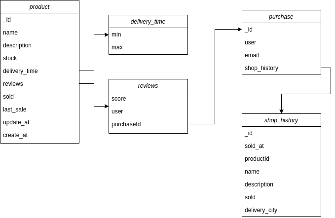

# XYZ BACK END

este es el diagrama de los modelos usados e implementados, contiene los datos básicos para hacer un control de inventario y ventas de productos, se hace control de de ventas en relación con el stock, el usuario puede agregar una review de 1 a 5, a un producto adquirido, al adquirir los productos estos se agregan en el historial de compras y devuelve al cliente una fecha estimada para la entrega, al crear varias veces el mismo producto este suma a la cantidad existente de stock.

todo el manejo de base de datos esta hecho con mongoDB, por el momento el backend esta desplegado en heroku bajo este link [heroku](https://xyzbackennd.herokuapp.com/) 

### Author 

[Cris-Mur](https://github.com/Cris-Mur)

